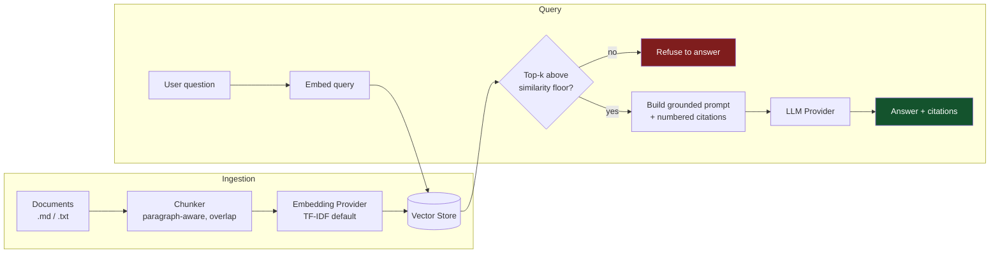

# Evidence-First Enterprise RAG Platform

Retrieval evaluation, citation traceability, and abstention for enterprise
knowledge bases.

A retrieval-augmented generation service that answers natural-language
questions over an internal knowledge base — and **refuses to answer when
the retrieved evidence doesn't support a claim**, rather than letting the
model improvise. Built as a FastAPI service with clean provider
abstractions (embeddings, vector store, LLM), so the lightweight local
stack below can be swapped for managed Azure services without touching
business logic.

> Grew out of statistical-rigor habits from my master's thesis on LLM
> pipeline reliability (layered validation, pre-registered evaluation,
> never trusting a single unverified pass) — applied here to a
> production-shaped RAG service instead of a research pipeline.

## Why grounding, not just retrieval

Most RAG demos stop at "retrieve chunks, stuff them in a prompt." This one
adds a hard floor: if nothing retrieved clears a similarity threshold, the
API returns an explicit "I don't have grounded information for that"
instead of asking the LLM to fill the gap. Every answer that *is* returned
carries its supporting citations (source document, chunk id, similarity
score) so a user can verify it.

## Architecture



| Stage | This build (local / CI) | Optional upgrade | Production swap-in |
|---|---|---|---|
| Embeddings | **TF-IDF** (scikit-learn, no GPU deps) | sentence-transformers (semantic) | Azure OpenAI embeddings |
| Vector store | FAISS, on-disk index | — | **Azure AI Search** (hybrid keyword+vector, RBAC-scoped indexes) |
| Generation | **Anthropic Claude** via API | — | **Azure OpenAI** deployment |
| Serving | FastAPI + Uvicorn, Dockerized | — | Same image, behind Azure Container Apps / AKS |

Every stage is implemented as an adapter behind an abstract base class —
`EmbeddingProvider`, `VectorStore`, `LLMProvider` (in `app/services/`).
Ingestion, chunking, retrieval, grounding, and the API surface are
provider-agnostic and don't change when you swap a backend.

**Why TF-IDF by default, not a transformer model?** The default install
has zero GPU/ML-framework dependencies (no torch, no multi-GB download) —
it installs and runs in seconds, which matters for a repo other people
will actually clone and CI will actually run on every push. It's also a
deliberate callback to the thesis: the lexical-similarity technique
(TF-IDF here) is the same approach used in the "cheap" mode of that
project's backlog-coherence detector, where the finding was that the
cheapest signal often does the job. `sentence-transformers` is one config
flag away (`EMBEDDING_PROVIDER=sentence_transformer`) for a corpus that
needs true semantic matching — see `requirements-embeddings-extra.txt`.

The Azure adapters (`AzureAISearchVectorStore`, `AzureOpenAIProvider`) are
included as documented stubs — the interface a real deployment would
implement — since no Azure resources are provisioned for this portfolio
build.

## Features

- Grounded answers only — refusal path when retrieval confidence is low, not a hallucinated guess
- Inline citations with source document, chunk id, and similarity score
- Pluggable embedding, vector-store, and LLM backends (lightweight local stack vs. Azure production stack)
- Simple API-key auth on the write/query endpoints
- Dockerized, with a GitHub Actions CI pipeline (lint + tests, no secrets required — tests run against a `MockProvider`)
- Deterministic, key-free test suite covering the happy path, the refusal path, and the empty-index path

## Project structure

```
app/
  main.py                 FastAPI app: /health, /ingest, /query
  config.py                Settings (env-driven)
  models/schemas.py        Request/response contracts
  services/
    ingestion.py             Document loading + chunking
    embeddings.py            TF-IDF (default) / sentence-transformer (optional) providers
    vector_store.py          FAISS (+ Azure AI Search stub)
    llm_provider.py          Anthropic / Mock (+ Azure OpenAI stub)
    rag_pipeline.py          Orchestrates retrieval -> grounding -> generation
data/sample_docs/         Fictitious company knowledge base (HR, security, onboarding, product FAQ)
scripts/ingest.py         CLI to build the index without starting the server
tests/test_pipeline.py    End-to-end tests using MockProvider (no API key needed)
.github/workflows/ci.yml  Lint + test on every push/PR
Dockerfile, docker-compose.yml
```

## Quickstart

```bash
python -m venv .venv && source .venv/bin/activate
pip install -r requirements-dev.txt

cp .env.example .env
# edit .env and set ANTHROPIC_API_KEY=sk-ant-...

python scripts/ingest.py            # builds the TF-IDF + FAISS index from data/sample_docs
uvicorn app.main:app --reload       # http://localhost:8000/docs
```

```bash
curl -X POST http://localhost:8000/query \
  -H "Content-Type: application/json" \
  -H "X-API-Key: change-me-local-dev-key" \
  -d '{"question": "How many days per week can I work remotely?"}'
```

Or with Docker:

```bash
docker compose up --build
```

### Running tests (no API key needed)

```bash
LLM_PROVIDER=mock pytest -v
```

### Using the semantic embedding upgrade

```bash
pip install -r requirements-embeddings-extra.txt
# set EMBEDDING_PROVIDER=sentence_transformer in .env, then re-run ingest
```

## Design notes

**Provider abstraction, applied consistently.** `EmbeddingProvider`,
`VectorStore`, and `LLMProvider` are each an abstract base class with one
concrete, working implementation plus a `Mock`/stub for the other side.
This is the same reason the thesis pipeline separated its repair model
from its judge model: swapping the underlying model shouldn't require
rewriting the pipeline around it.

**Refusal over hallucination.** The similarity floor (`MIN_SIMILARITY`)
is a blunt instrument compared to the thesis's calibrated judge-and-abstain
gate, but the principle is the same: an unverifiable answer is worse than
no answer, and the system should know the difference.

**What's a stub and why.** `AzureAISearchVectorStore` and
`AzureOpenAIProvider` are included to show the intended production
architecture and the exact interface a real deployment would implement —
not to fake integration I haven't built. Provisioning real Azure
resources was out of scope for a self-funded portfolio project.

## Roadmap

- Implement the Azure OpenAI / Azure AI Search adapters against a real (dev-tier) Azure subscription
- Streaming responses (SSE) instead of single-shot completions
- Azure AD-backed auth in place of the demo API-key header
- A small evaluation harness (retrieval precision@k, groundedness rate) in the same pre-registered-metrics spirit as the thesis work

## License

MIT — see [LICENSE](LICENSE).
